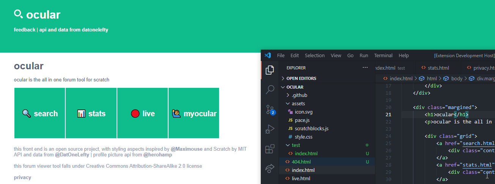
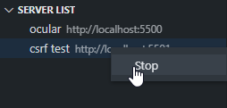
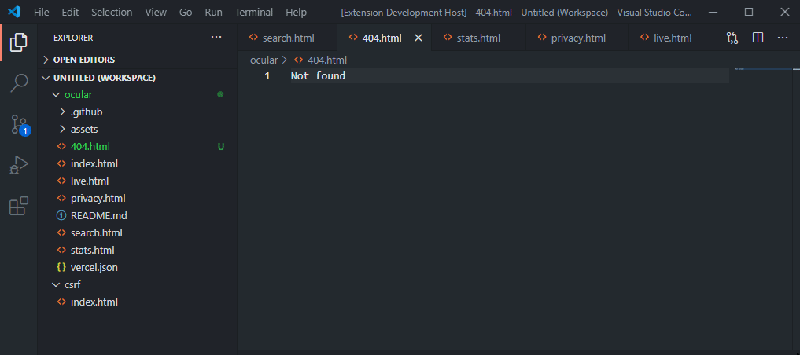

# `lived` for Visual Studio Code

 

Quickly start a local development server for static pages.

## Features

- Quickly start a local web-server to host static files
- Live reload when files are saved

    

- Works great with Live Share
- Imitate a GitHub pages environment
    - html file extension is not required
    - automatically route 404s to 404.html
- Easily manage multiple servers

    

- Multi-root workspace support 

    

## Requirements

- Visual Studio Code

## Extension Settings

Coming soon

## Changelog

### 0.4.4

- Supports live share
    - Servers get automatically shared (You may need to click allow)
- Fixed bug with multiple servers running on the same folder

### 0.4.3

- Fix path traversal (thank you @GarboMuffin !!)
- Works on linux (maybe)

### 0.4.2

Revert experimental changes from 0.4.1 😅

### 0.4.1

Experimental release (vscodeignore node_modules?)

### 0.2.0 / 0.3.0 / 0.4.0

_failed to publish a couple times_

- Live reload!!!
    - html pages will automatically reload if a html or js file was updated
    - when a css file is updated, the page will update without reloading 😲 🤯
    - in the future, there will be many options for this

### 0.1.0

- Marketplace updates
- Internal code updates to prepare for live reload

### 0.0.1

Initial release